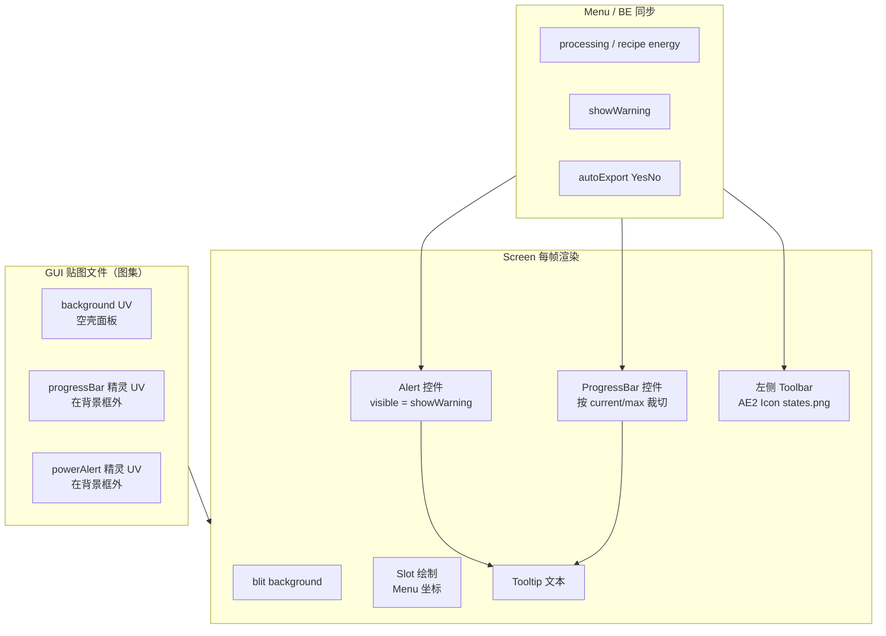

# 报告：充能台 GUI 该怎么用（对照 AE2 / AdvancedAE `reaction_chamber`）

> 状态：**只调研、不改代码**  
> 触发：隔壁 AI 未看清 mock 图就覆盖 GUI，并把进度条、警示标志当成静态 GUI 的一部分  
> 依据：你提供的两张 mock、`asset/reaction_chamber_gui/`、本地 `refs/` 源码、当前 AP GUI 实现

---

## 0. 结论先行

你的两张图 **不是**「整张 GUI 贴图直接 blit 就完事」。它们是 **示意稿**，表达了和 AdvancedAE `reaction_chamber` 同一套机理：

| 图中的元素 | 是什么 | 正确用法 |
|-----------|--------|----------|
| 灰底面板 + 槽位框 + 箭头 + 物品栏 | **静态背景** | 裁成 background texture，按槽坐标摆 Slot |
| 输出右侧细竖条 | **进度条控件的轨道/精灵** | 单独 UV + 运行时 `ProgressBar` 按进度裁切绘制；**不是**背景里画死的填充条 |
| 右上角黄底 `!` | **电力/状态警示控件** | 单独 UV（或 Icon）+ 运行时 `visible = showWarning`；**默认可隐藏**，不是背景的一部分 |
| 面板左侧外的按钮（问号 / 自动输出） | **左侧工具条** | 运行时用 AE2 `Icon`（`states.png`），**不画进** background |
| `with-4-block` 多出的右侧 4 槽 | **高级台棒槽** | 只属于高级台背景/槽位；ME 台用 `without-4-block`，无这 4 槽 |

一句话：**背景贴图只负责「空壳面板」；进度、警示、工具条按钮是叠在上面的动态控件。** 这就是 `reaction_chamber` 的机理。

---

## 1. 你给的两张 mock 在说什么

文件：

- `asset/orb/results/without-4-block.png` — **ME 充能台**（无 4 棒槽）
- `asset/orb/results/with-4-block.png` — **高级充能台**（有 4 棒槽）

画布均为 **256×256**，有效内容约 **x∈[0,199], y∈[0,198]**。

### 1.1 共同结构（两图一致）

```
┌──────────────────────────────────────┐  ← 灰面板（background）
│  [3×3]  ──►  [输出]  │进度轨│        │
│                       ┌─┐┌─┐┌─┐┌─┐  │  ← with-4-block 才有这 4 槽
│                       └─┘└─┘└─┘└─┘  │
│  [玩家背包 9×3 + 快捷栏]              │
└──────────────────────────────────────┘
         ↑ 面板外左侧：工具条按钮（代码画，不在背景里）
                              面板外右上：黄色 ! 警示（动态控件，不在背景里）
```

像素粗测（与 AAE `reaction_chamber.png` 同源风格）：

| 区域 | without | with-4-block | AAE reaction_chamber |
|------|---------|--------------|----------------------|
| 主灰面板 bbox | ≈ (2,2)–(173,194) | 同左 | ≈ (2,2)–(173,175)（无背包，更高的是含背包的 mock） |
| 槽位浅灰 bbox | (8,31)–(167,188) | (8,23)–(168,188) | (8,22)–(167,169) |
| 右上警示/图集条 | x≈176–198 有内容 | 同左 | x=176–199 为 progress/alert 精灵区 |
| 内容总宽 | 到 x≈199 | 到 x≈199 | 到 x≈199 |

`with` 的槽位浅灰 **y 起点更高（23 vs 31）**，与右侧 4 棒槽起始位置一致；代码注释也写了「matches with-4-block GUI mock」。

### 1.2 你当时还给了什么

历史会话原文（你给隔壁 AI 的任务）要点：

1. 两张 UI：有四格 = 高级台，无四格 = ME 台。
2. 另有图标集：`asset/orb/results/ae-states.png`、`aae-states.png`。
3. **主面板之外** 还应有两个左侧按钮：
   - 第一个：AAE 左上角问号 → 打开本机 GuideME 页。
   - 第二个：自动输出开关，图标来自 `ae-states.png` **第 7 行第 8/9 列**（关/开）。
4. 运行时 **默认复用 AE2 `states.png`**；非 AE2 图标再从 AAE 等提取到 `asset/reaction_chamber_gui/`。
5. 自动输出 = 产物直接 insert 进 ME 存储（效仿 AE2 ME Interface）。
6. **机理类似 `reaction_chamber`**（即本报告核心）。

这些信息在 mock **画面之外**，隔壁 AI 若只「看图裁切」必然丢层。

---

## 2. `reaction_chamber` 到底怎么用 GUI（权威机理）

参考文件（本地只读）：

| 文件 | 作用 |
|------|------|
| `refs/1.20.1/AdvancedAE-.../client/gui/ReactionChamberScreen.java` | 客户端：进度条 + 自动输出 + 电力警示控件 |
| `refs/1.20.1/AdvancedAE-.../gui/ReactionChamberMenu.java` | 服务端同步：`processingTime` / `autoExport` / `showWarning` |
| `assets/aae/ae2/screens/reaction_chamber.json`（或 `asset/reaction_chamber_gui/ae2/screens/`） | AE2 **ScreenStyle** 布局：background / images / widgets 分离 |
| `refs/.../appeng/client/gui/widgets/ProgressBar.java` | AE2 进度条控件 |
| `refs/.../appeng/client/gui/Icon.java` | AE2 `states.png` 图标枚举 |
| `refs/.../appeng/client/gui/implementations/InscriberScreen.java` | AE2 原生机器同一模式（压印机） |
| `refs/.../appeng/client/gui/style/ScreenStyle.java` | JSON 布局如何描述 background/images/widgets |

### 2.1 贴图是 **图集（atlas）**，不是「一整张都是背景」

`reaction_chamber.json`：

```json
"background": {
  "texture": "guis/reaction_chamber.png",
  "srcRect": [0, 0, 176, 180]
},
"images": {
  "progressBar": {
    "texture": "guis/reaction_chamber.png",
    "srcRect": [176, 0, 6, 18]
  },
  "powerAlert": {
    "texture": "guis/reaction_chamber.png",
    "srcRect": [182, 0, 18, 18]
  }
},
"widgets": {
  "progressBar": { "left": 140, "top": 42 },
  "powerAlert":  { "left": 117, "top": 68 }
}
```

同一张 256×256 PNG 被 **切开使用**：

```
x:  0 ────────── 176   182   200
y:0 ┌────────────┬────┬─────┐
    │  background│ pb │alert│   ← pb=6×18, alert=18×18
    │ 176×180    │    │     │
    │ （面板空壳）│精灵│ 精灵 │
    │            │    │     │
    └────────────┴────┴─────┘
```

- **background 只含** 面板、槽位框、箭头等 **静态空壳**。
- **progressBar / powerAlert 的像素在背景框外**，由 `images` 引用，再由 `widgets` 定位到屏幕上。
- 因此：**把 mock 整图（含警示、含进度填充）直接当 background 是错的。**

AE2 原生压印机同理（`inscriber.json`）：

```json
"background": { "srcRect": [0, 0, 176, 176] },
"images": { "progressBar": { "srcRect": [135, 177, 6, 18] } },
"widgets": { "progressBar": { "left": 135, "top": 39 } }
```

进度精灵在背景 **下方图集区** `y=177`，运行时叠到 `top=39`。

### 2.2 进度条：运行时控件，不是背景装饰

`ReactionChamberScreen`：

```java
this.pb = new ProgressBar(this.menu, style.getImage("progressBar"),
        ProgressBar.Direction.VERTICAL);
widgets.add("progressBar", this.pb);
// ...
int progress = this.menu.getCurrentProgress() * 100 / this.menu.getMaxProgress();
this.pb.setFullMsg(Component.literal(progress + "%"));
```

`ProgressBar.renderWidget`（AE2）本质：

- 读取 `IProgressProvider.getCurrentProgress() / getMaxProgress()`；
- **VERTICAL**：从精灵 **顶部裁掉** 未完成高度，只 blit 已填充部分（或相反方向裁切）；
- 高度 `srcH`/`destY` 随 `current/max` 变化 → **同一张静态精灵，画面随进度变**。

Menu 侧同步（`ReactionChamberMenu`）：

```java
@GuiSync(3) public int processingTime = -1;
@GuiSync(2) public int maxProcessingTime = -1;

public int getCurrentProgress() { return this.processingTime; }
public int getMaxProgress()     { return this.maxProcessingTime; }
```

**含义 for AP 充能台：**

- mock 里输出旁的细竖条 = **进度控件的落点/轨道示意**。
- 背景里最多保留 **空轨道**（可选）；填充必须由 Screen 按 `getProgress()/getRecipeEnergy()` 画。
- 不要在 background 上画「绿色进度已满」之类静态填充。
- 有反应/有配方能量时才显示或填充；无进度时轨道可空或隐藏。

### 2.3 警示标志：条件显示的状态控件

`ReactionChamberScreen`：

```java
this.powerAlert = new AlertWidget(style.getImage("powerAlert"));
this.powerAlert.setTooltip(Tooltip.create(Tooltips.of(
        AAEText.InsufficientPower.text().withStyle(Tooltips.RED),
        ...)));
this.widgets.add("powerAlert", this.powerAlert);

// 每帧：
this.powerAlert.visible = this.getMenu().getShowWarning();
```

Menu：

```java
@GuiSync(8) public boolean showWarning = false;

// standardDetectAndSendChanges 服务端：
this.showWarning = getHost().showWarning();
```

Entity 逻辑（反应仓）：

- 电力足够 → 正常推进进度，`setShowWarning(false)`；
- 电力 **不够满速**（能抽到一部分但低于阈值）→ 降速推进 + `setShowWarning(true)`；
- 手册写明：电网缓冲不足时 **progress slowed + warning on screen**。

**含义 for AP 充能台：**

- mock 右上角黄 `!` = **电力/供能不足警示控件的示意位置**，**不是** 背景像素。
- 应单独裁 UV（或用 Icon），默认 `visible=false`，仅当（高级台）网络抽能不足 /（ME 台）有配方但棒未供上能 等条件时显示。
- 应带 tooltip（红色标题 + 灰字说明），对齐 AE2 `Tooltips.RED` / `NORMAL_TOOLTIP_TEXT`。
- **永远不要** 把黄三角烘进 `me_energizing_orb.png` / `advanced_energizing_orb.png` 的 background。

### 2.4 左侧工具条：AE2 Icon，不进本模组背景

用户指定 + AAE/AE2 惯例：

| 按钮 | 图标来源 | 运行时 API |
|------|----------|------------|
| 打开 GuideME | AE2 `Icon.HELP` → `states.png` UV (176, 0) | `OpenGuideButton` / 自定义 `addToLeftToolbar` |
| 自动输出 开/关 | AE2 `Icon.AUTO_EXPORT_ON/OFF` → (128,96)/(112,96) | `ServerSettingToggleButton<>(Settings.AUTO_EXPORT, YesNo)` 或 AP 自有开关 |

`ReactionChamberScreen`：

```java
this.autoExportBtn = new ServerSettingToggleButton<>(Settings.AUTO_EXPORT, YesNo.NO);
this.addToLeftToolbar(autoExportBtn);
```

`Icon.java` 注释：**Edit in `assets/ae2/textures/guis/states.png`** —— 图标住在 AE2 贴图集，附属模组 **运行时复用**，不要打进 AP resources（除非 AE2 没有的图标才从 AAE 提取）。

你已提取到 `asset/reaction_chamber_gui/extracted/`：

- `ae2/help.png`, `auto_export_on/off.png`, `toolbar_bg_16.png` …
- `advanced_ae/me_export_on/off.png`, `direction_output.png`, `states.png` …

`ICONS.md` 已写清 UV 表。**这些是图标素材，不是 GUI 背景。**

当前 AP `EnergizingOrbScreen` 其实已经在左侧画了两个按钮（`TOOLBAR_X = -20`，用 `Icon.HELP` / `Icon.AUTO_EXPORT_*`）—— **方向是对的**；问题主要在 **背景裁切 + 进度/警示的定位与语义**。

---

## 3. AE2 系 GUI 的分层模型（正确 mental model）



**禁止的错误分层：**

- 把整个 mock PNG（含警示、含进度示意）`blit` 成 background。
- 把 toolbar 按钮、警示标画进 background 再「假装是 GUI」。
- 进度条用 `g.fill` 绿色块却 **没有** 对应的 menu 进度语义 / 或位置与 mock 轨道不一致却不说明。
- 用 AE2/AAE **运行时已有** 的 Icon，却又复制一份进本模组贴图当背景装饰。

---

## 4. 当前 AP 实现 vs 机理（对照表）

代码位置：

- `common/.../orb/EnergizingOrbScreen.java`
- `common/.../orb/EnergizingOrbMenu.java`
- 贴图：`assets/applied_powah/textures/gui/me_energizing_orb.png`（176×166）
- 贴图：`assets/applied_powah/textures/gui/advanced_energizing_orb.png`（222×166，alpha 到 x≈199）

| 项目 | reaction_chamber 正确机理 | 当前 AP | 判定 |
|------|---------------------------|---------|------|
| 背景职责 | 仅空壳；动态元素用独立 UV | 直接 blit 用户裁切图 | **部分正确**（若裁切时未含警示则尚可） |
| 进度条 | 独立精灵 + `ProgressBar`/裁切 + menu 同步 | `g.fill` 绿色块，`PROG_X=88,Y=44,W=16,H=6` | **方向可**（动态绘制），但未按 reaction_chamber 的 **图集分层 + 显式 track/fill + IProgressProvider** 做；hover 文案有 |
| 警示标志 | 独立控件 + `showWarning` 同步 + tooltip | **未实现**；mock 里的 `!` 未被理解为控件 | **缺失** |
| 左侧工具条 | AE2 Icon + toolbar，面板外 | 已实现 HELP + AUTO_EXPORT，`leftPos-20` | **基本正确** |
| ME vs 高级 贴图 | 两套 background | 两套：176 vs 222 | **意图对**，但 222 宽是否含入警示区需按 mock 重裁 |
| 棒槽坐标 | 槽在面板几何内 | Menu：`x=180, y=14+i*18`；`GUI_W_ADV=222` | **可疑**：mock 槽位浅灰约到 x≈168，`180` 可能贴在面板外/图集区 |
| 输出槽 | 只读 | `mayPlace=false`，`x=116,y=35` | 合理，需与 mock 对齐复核 |
| 输入槽 | 6 格 | `{44,17},{62,17},{80,17},{44,35},{62,35},{80,35}` | 合理，需与 mock 对齐复核 |
| 自动输出语义 | ME Interface 式 insert | Guide 写了；Screen 有开关；BE 有 autoExport | 机理有，与 GUI 问题独立 |
| ScreenStyle JSON | AE2 `screens/*.json` | 自定义 `AbstractContainerScreen` | **可接受**（附属可不用完整 AE2 Screen 管线），但 **图集分层与控件语义仍要遵守** |

### 隔壁 AI 具体错在哪（可复述给对方）

1. **没先读懂 mock 的分层**：整图不是 background；警示在面板外、进度是动态轨。
2. **直接覆盖贴图**：把示意稿裁成运行时 GUI，未区分「空壳 / 精灵 / 工具条」。
3. **把进度条和警示当 GUI 静态部分**：与 `reaction_chamber`（以及 AE2 压印机）的 **ProgressBar + powerAlert 控件** 机理相反。
4. **未落实你点名的图标策略**：应优先 `Icon.*` / AE2 `states.png`，AAE 特有图标进 `asset/reaction_chamber_gui/extracted/`，而不是混进背景。
5. **槽位/画布尺寸未与 mock 像素对齐**（棒槽 x=180、advanced 宽 222 存疑）。

---

## 5. 两张 mock 应如何映射到运行时（规范建议，仍不改代码）

### 5.1 贴图切分建议（图集）

对 `without-4-block.png` / `with-4-block.png`：

```
[ background 空壳 ][ progress 精灵 ][ alert 精灵 ]
     ↑ 槽框+箭头+背包      ↑ 6×18 类       ↑ 18×18 类
```

- **ME 台 background**：约 176×166（或与 mock 面板+背包等价的矩形），**不要** 含右上黄 `!`。
- **高级台 background**：同上宽度上 **扩展出 4 棒槽框**；若 4 槽在 x≈176 内，则 **不必** 无脑加宽到 222。
- **progress / alert**：放在 background `srcRect` **之外** 的图集空白（例如 x≥176），用独立 UV 引用。
- 当前仓库里 `me_energizing_orb.png` 176×166 较干净；`advanced_energizing_orb.png` 222 宽且 alpha 到 199，**疑似把右侧图集/警示区卷进了文件**，需按本报告重裁（改代码前先重切资源）。

### 5.2 控件职责

| 控件 | 数据源 | 显示条件 | 坐标 |
|------|--------|----------|------|
| 进度条 | `orb.getProgress()` / `getRecipeEnergy()`（高级台缓存推进时用缓存） | `max>0`；0 时空轨或隐藏 | mock 输出右侧轨道，约输出槽旁 |
| 进度 tooltip | 同上 + 百分比 | hover 进度区 | 已有类似文案，可保留 |
| 缓存文本 | 高级台 `getDisplayEnergy/Capacity` | 仅 Advanced | 你 mock 未强制；可在面板文字区，**不是** 警示标 |
| 警示 `!` | 新增：BE/Menu `showWarning`（ME：有配方无棒供能；Advanced：抽网不足等） | 条件为真 | mock 右上（面板外或指定角），**默认隐藏** |
| 问号 | GuideME 打开 `ap_intro/energizing-orbs.md` | 恒显示 | 面板外左侧 toolbar |
| 自动输出 | `isAutoExport()` + C2S 包 | 恒显示，图标切换 on/off | toolbar 第二钮，AE2 AUTO_EXPORT 图标 |

### 5.3 与「类似 reaction_chamber」的映射

| reaction_chamber | AP 充能台 |
|------------------|-----------|
| 输入槽 + 输出槽 | 6 输入 + 1 输出（只读） |
| 流体槽 | 无（高级台改为 4 棒槽） |
| ProgressBar VERTICAL | 配方/缓存能量进度 |
| powerAlert / showWarning | 供能不足警示（语义按 AP 两台分别定义） |
| AUTO_EXPORT 工具钮 | 自动输出进 ME |
| 方向输出按钮 | 本期可不做（你 mock 未要求） |
| 升级槽 | 本期无 |

---

## 6. 资源清单（已存在，改代码前先用对）

### 6.1 Mock 与图标（`asset/`，不入 git）

| 路径 | 用途 |
|------|------|
| `asset/orb/results/without-4-block.png` | ME 台 UI 示意 |
| `asset/orb/results/with-4-block.png` | 高级台 UI 示意 |
| `asset/orb/results/ae-states.png` | AE2 风格状态图集（你提取） |
| `asset/orb/results/aae-states.png` | AAE 状态图集（你提取） |
| `asset/reaction_chamber_gui/ae2/screens/reaction_chamber.json` | 布局 JSON 参考 |
| `asset/reaction_chamber_gui/ae2/textures/guis/reaction_chamber.png` | 官方图集参考 |
| `asset/reaction_chamber_gui/src/ReactionChamberScreen.java` | 控件用法参考 |
| `asset/reaction_chamber_gui/extracted/ae2/*` | HELP / AUTO_EXPORT / toolbar 底 |
| `asset/reaction_chamber_gui/extracted/advanced_ae/*` | AAE 专用图标 |
| `asset/reaction_chamber_gui/ICONS.md` | UV 与用法表 |
| `asset/reaction_chamber_gui/README.md` | 布局要点 |

### 6.2 运行时应引用（不打进 AP 背景）

- AE2：`appeng.client.gui.Icon.HELP` / `AUTO_EXPORT_ON` / `AUTO_EXPORT_OFF`  
  （`ae2:textures/guis/states.png`）
- 需要完整 AE2 Screen 管线时再上 `assets/ae2/screens/*.json`；AP 当前 AbstractContainerScreen **也可以**，但必须手写同等分层。

### 6.3 项目文档中已有的相关约定

- `docs/PLAN_高级充能台与指导体系.md` §3.3：任务页要有进度条 + 弹出开关；棒槽宜侧栏；GUI 可先占位。
- `docs/调研_充能台_0.2.md`：高级台 UI = 占位 GUI + 翻页 + 进度条 + 弹出开关。
- `asset/reaction_chamber_gui/README.md` 已写：「进度条仅在有反应时显示」「能量展示走 Jade 等」——与 reaction_chamber 机理一致。

---

## 7. 正确落地顺序（供下一轮编码，本轮不执行）

1. **重切背景**：从两张 mock 只裁 **空壳面板**（含槽框/箭头/背包；高级含 4 槽框）→ `textures/gui/*.png`。  
2. **单独切 progress / alert 精灵** 到图集空白或独立小 PNG；**不要** 并进 background。  
3. **对齐 Slot 坐标**：用 mock 像素反推 Menu 的 `in[]`、输出、棒槽 x/y；复核 `x=180` 是否越界面板。  
4. **Screen 控件化**：进度用裁切绘制（仿 `ProgressBar`）；警示 `visible` + tooltip；toolbar 继续用 `Icon.*`。  
5. **Menu/BE 同步**：进度已基本有；补 `showWarning`（或等价状态）与自动输出的 GUI 语义。  
6. **进游戏对照** mock 与 AE2 机器观感，再谈是否迁移到完整 ScreenStyle JSON。

---

## 8. 附录：关键源码锚点

| 主题 | 位置 |
|------|------|
| RC 进度条控件创建 | `ReactionChamberScreen.java` L48–49, L105–106 |
| RC 警示控件 | 同文件 L70–76, L114, L126–141 |
| RC Menu 同步 | `ReactionChamberMenu.java` L34–44, L76–99, L110–125 |
| RC 供能→warning | `ReactionChamberEntity.java` 约 L372–403 |
| AE2 ProgressBar | `appeng/client/gui/widgets/ProgressBar.java` |
| AE2 Icon UV | `appeng/client/gui/Icon.java`（HELP/AUTO_EXPORT 等） |
| AE2 Inscriber 布局 | `assets/ae2/screens/inscriber.json` |
| AAE RC 布局 | `assets/aae/ae2/screens/reaction_chamber.json` |
| AP 当前 Screen | `EnergizingOrbScreen.java` |
| AP 当前 Menu | `EnergizingOrbMenu.java` L29–52（输出只读 + 棒槽） |

---

*本报告结论：mock 应按 `reaction_chamber` 分层使用——背景空壳、进度控件、警示控件、左侧 AE2 工具条四层分离；隔壁 AI 的错误在于未分层就覆盖贴图，并把动态控件当成静态 GUI。*
